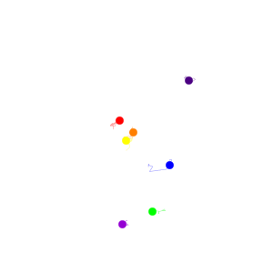
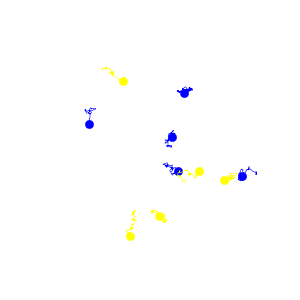

imcmc
=====
*It probably makes art.*

`imcmc` (*im-sea-em-sea*) is a small library for turning 2d images into probability distributions
and then sampling from them to create images and gifs. 


Installation
------------
This is actually `pip` installable from git!

```
pip install git+https://github.com/ColCarroll/imcmc
```

Quickstart
----------

See [imcmc.ipynb](examples/imcmc.ipynb) for a few working examples as well.

```
import imcmc


image = imcmc.load_image('python.png', 'L')

# This call is random -- rerun adjusting parameters until the image looks good
trace = imcmc.sample_grayscale(image, samples=1000, tune=500, nchains=6)

# Lots of plotting options!
imcmc.plot_multitrace(trace, image, marker='o', markersize=10,
                      colors=['#0000FF', '#FFFF00'], alpha=0.9);

# Save as a gif, with the same arguments as above, plus some more
imcmc.make_gif(trace, image, dpi=40, marker='o', markersize=10,
               colors=['#0000FF', '#FFFF00'], alpha=0.9, 
               filename='example.gif')
```

Built with
----------

`Pillow` does not have a logo, but the other tools do!








Here's a tricky one whose support I appreciate
----------------------------------------------

I get to do lots of open source work for [The Center for Civic Media](https://civic.mit.edu/) at 
MIT. Even better, they have a super multi-modal logo that I needed to use 98 chains to sample from!

![Center for Civic Media][examples/civic.gif]


Further work
------------

There are some functions in there to sample from the RGB channels of real images, but the reconstructed
images just look blurry, and the gifs just look like they are awkward fades. Still working on it!
